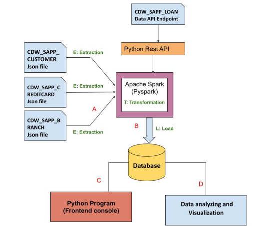

# cc_capstone
Data engineering project that extracts data from a json api and files to visualize correlations.

Loan application and credit card datasets undergo ETL using Python, MariaDB, Apache Spark, and Python Visualization libraries.
To run the virtual environment, open the terminal, go to this directory and activate the virtual environment with
`Scripts\activate`
Download dependencies with 
`pip install -r requirements.txt`
Run jupyter-lab with
`jupyter-lab`
When finished, close the virtual environment with
`deactivate` or `Scripts\deactivate`

This dataset has about a thousand randomly generated SSNs, so I had problems seeing all total sums on a bar graph.  The lines representing each SSN were so small.  Instead, I've used scatter plots.  Hovering over a point will provide information.  The multi-line plot showing approved applications per application demographic was vague, because each demographic had different ways of measuring.  For example, options for dependents vary from 0, 1, 2, or 3+ in text format, but options for Married can be Yes or No.  Looking at the last chart will not tell whether a house is in a semiurban, rural, or urban location.  On the feature branch, I can investigate the pd.get_dummies(<dataframe>) method and using plotly to show data when hovering the chart.